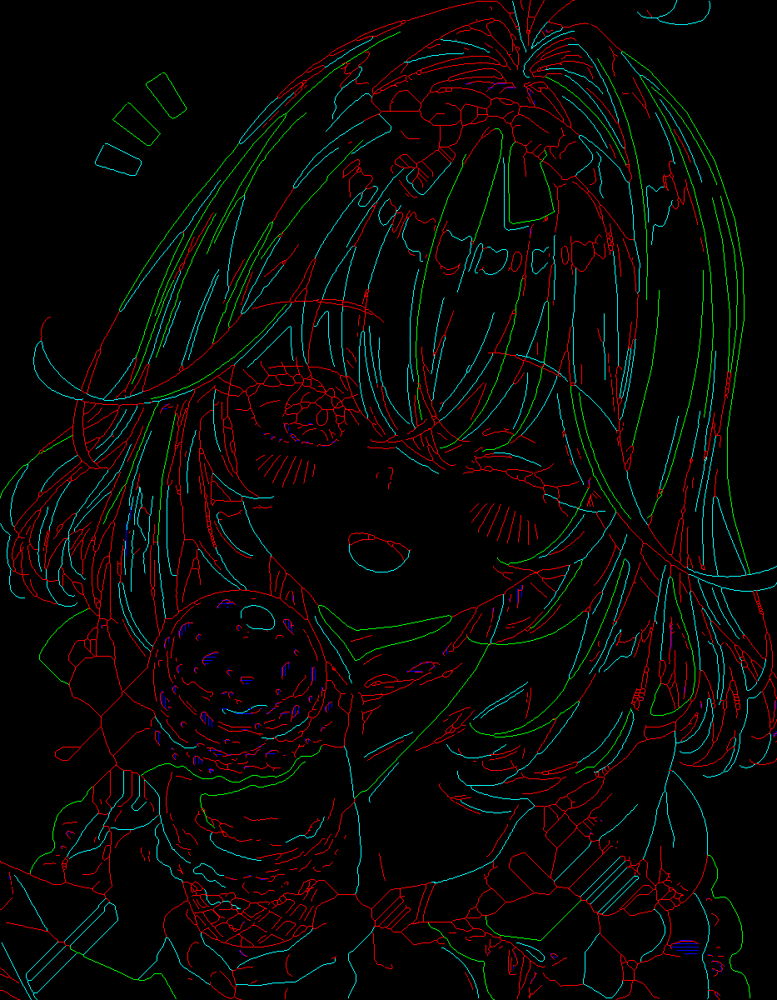
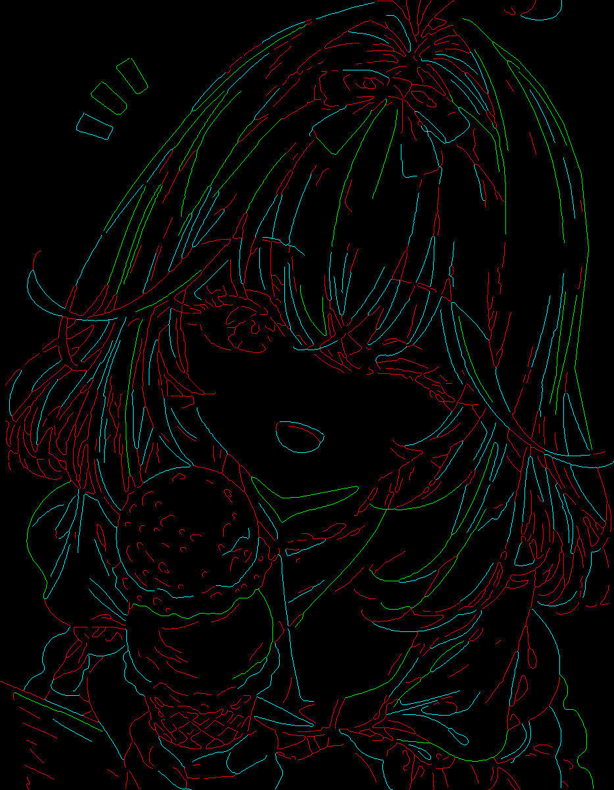
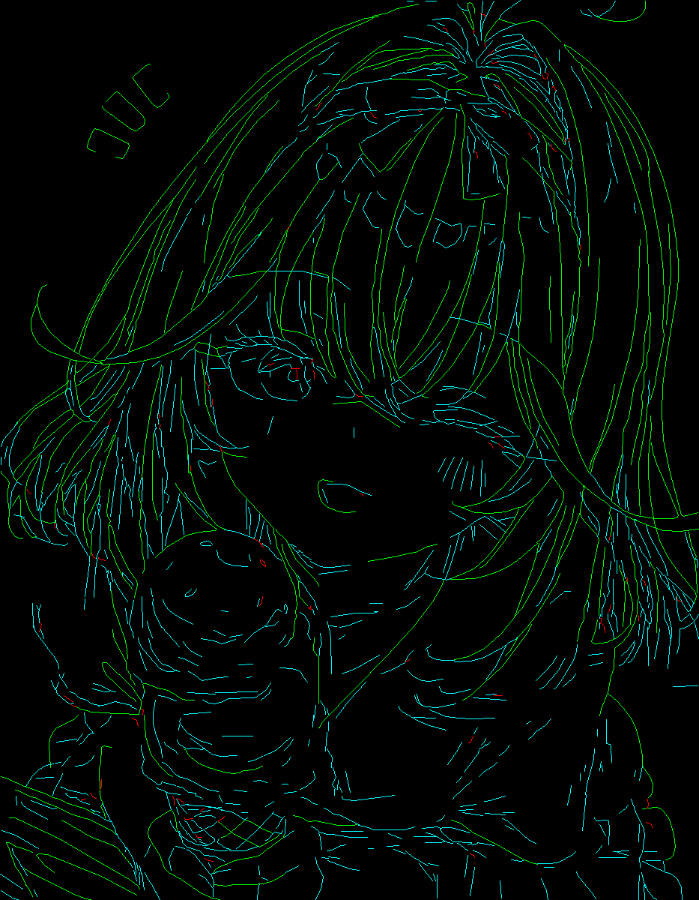
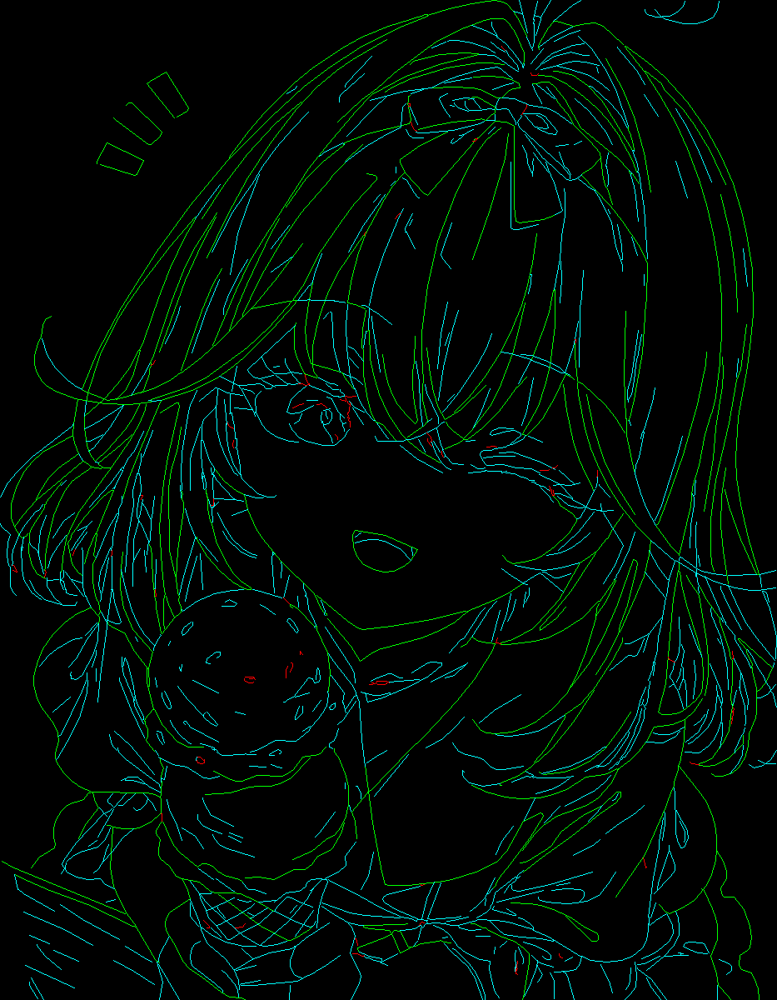

# SlayTheSpire2AutoDrawing 改进版

## 如何运行

### 1. 安装依赖

建议在 Windows 环境运行。本项目会注册全局快捷键并控制鼠标，通常需要管理员权限。

```powershell
cd E:\code\painting\SlayTheSpire2AutoDrawing-main
pip install -r requirements.txt
```

主要依赖：

```text
pyautogui
keyboard
opencv-python
numpy
pillow
scikit-image
onnxruntime
svgpathtools
```

### 2. 启动程序

```powershell
python AutoDrawer.py
```

如果系统弹出管理员权限确认，请允许。原因是：

```text
1. keyboard 需要注册 F8/F9/F10 等全局快捷键。
2. pyautogui 需要控制鼠标在游戏窗口中绘制。
```

### 3. 基本流程

```text
1. 启动 AutoDrawer.py。
2. 选择图片，例如 E:\code\painting\color4.jpg。
3. 选择是否启用 ONNX 彩色转线稿。
4. 选择快速模式或高质量模式 (高质量模式吃性能)。
5. 点击开始推理，等待路径生成。
6. 在游戏内准备绘制区域。
7. 按 F9 开始绘制。
8. 按 F8 暂停/继续。
9. 按 F10 停止。
10. 推荐每张图先尝试onnx-fast再尝试高质量
```

推荐绘制参数：

```text
快速模式：
  drag_step = 2 到 5

高质量模式：
  drag_step = 1 到 2
  delay = 0.02 左右
```

## 效果展示：样例：color4 的四种组合

项目中包含 `color4` 的四种输出样例，分别展示 ONNX 和高质量模式的组合效果。

### final_paths.png 颜色含义

`final_paths.png` 是最终路径预览，最接近绘制器会使用的路径结构。

常见颜色含义：

| 颜色 | 路径级别 | 含义 |
| --- | --- | --- |
| 绿色 | `outline` | 主轮廓 / 长路径，占比越大绘制越流畅 |
| 黄色 | `normal` | 普通线条 |
| 红色 | `detail` | 细节线条，以点为主。 |
| 蓝色 | `fill` | 填充/覆盖路径，主要出现在快速模式的填充区域 |

说明：

```text
红色不是错误，代表 detail 细节路径。
绿色不是最终颜色，代表 outline 主轮廓路径。
实际游戏中绘制出来的颜色由游戏/鼠标绘制工具决定，不由 final_paths.png 决定。
```

### 1. 原图 + 快速模式

目录：

```text
output/color4_fast/
```

关键文件：

```text
output/color4_fast/skeleton.png
output/color4_fast/final_paths.png
output/color4_fast/inference_config.json
```

预览：



特点：

```text
1. 不经过 ONNX。
2. 不经过 DeepSketch。
3. 直接从原图提取 skeleton 路径。
4. 存在大量由原图主导的点的信息导致大量绘制抖动。
5. 如果使用深色背景会导致大量背景填充，角色空白。
```

适合：

```text
调试、快速预览、简单线条图。
```

### 2. ONNX + 快速模式

目录：

```text
output/color4_onnx_fast/
```

关键文件：

```text
output/color4_onnx_fast/onnx.png
output/color4_onnx_fast/skeleton.png
output/color4_onnx_fast/final_paths.png
output/color4_onnx_fast/inference_config.json
```

预览：




特点：

```text
1. 先用 ONNX 将彩色图转换为线稿。
2. 再从 ONNX 线稿提取 skeleton 路径。
3. 比原图快速模式更干净。
4. 速度仍然较快。
```

适合：

```text
日常推荐组合，用于快速确认构图和路径是否合理。
```

### 3. 原图 + 高质量模式

目录：

```text
output/color4_quality/
```

关键文件：

```text
output/color4_quality/deepsketch.svg
output/color4_quality/final_paths.png
output/color4_quality/ordered_paths_high_quality.json
output/color4_quality/path_quality_stats.json
output/color4_quality/inference_config.json
```

预览：



质量统计：

```text
parser: svgpathtools
raw_path_count: 1062
raw_point_count: 26431
optimized_path_count: 1062
optimized_point_count: 4367
sample_step: 1.5
recommended_drag_step: 1
```

特点：

```text
1. 不经过 ONNX，直接将原图交给 DeepSketch。
2. 会生成 deepsketch.svg。
3. 使用 svgpathtools 解析 SVG 路径。
4. 曲线和结构比快速模式更好。
5.表达效果优于快速模式但是吃性能。
```

适合：

```text
原图线条明确，并且希望获得更平滑路径的场景。
```

### 4. ONNX + 高质量模式

目录：

```text
output/color4_onnx_quality/
```

关键文件：

```text
output/color4_onnx_quality/onnx.png
output/color4_onnx_quality/deepsketch.svg
output/color4_onnx_quality/final_paths.png
output/color4_onnx_quality/ordered_paths_high_quality.json
output/color4_onnx_quality/path_quality_stats.json
output/color4_onnx_quality/inference_config.json
```

预览：




质量统计：

```text
parser: svgpathtools
raw_path_count: 839
raw_point_count: 34817
optimized_path_count: 839
optimized_point_count: 4339
sample_step: 1.5
recommended_drag_step: 1
```

特点：

```text
1. 先用 ONNX 得到干净线稿。
2. 再用 DeepSketch 生成 SVG。
3. 再用 svgpathtools 转换为高质量路径点。
4. 通常是当前项目中质量最高的组合。
5. 推理最慢，对显存、CUDA、模型文件和依赖要求最高。
```

适合：

```text
最终出图、复杂图像、高质量绘制、愿意等待更长推理和绘制时间的场景。
```

## 项目改进说明

本项目是在原 `SlayTheSpire2AutoDrawing`（https://github.com/FugerQingliu/SlayTheSpire2AutoDrawing.git） 自动绘制工具基础上的改进版。原项目主要通过图像边缘或骨架路径提取，把图片转换为鼠标拖拽轨迹，再用 `pyautogui` 在游戏窗口中自动绘制。

当前版本将绘制功能完全重构为如下两条链路：

```text
快速模式：
图片 / ONNX 线稿 -> skeleton 像素骨架 -> ordered_paths -> 鼠标绘制

高质量模式：
图片 / ONNX 线稿 -> DeepSketch SVG -> svgpathtools 高质量路径采样 -> ordered_paths -> 鼠标绘制
```

最终绘制器实际使用的不是图片、SVG 或 skeleton 文件本身，而是多条有序路径点列。程序会把这些点从图片坐标映射到屏幕坐标，再逐点调用 `pyautogui.moveTo()` 完成鼠标拖拽。

### 主要改进

```text
1. 增加 ONNX 本地线稿转换，降低彩色图纹理和阴影干扰。
2. 增加 DeepSketch 高质量 SVG 矢量化。
3. 使用 svgpathtools 解析 SVG 路径，支持 M/L/C/Q/A 等 path。
4. 延后整数化，尽量保留 float 路径精度。
5. 输出 inference_config.json、path_quality_stats.json、ordered_paths_high_quality.json，便于复现和排查。
6. 高质量模式默认使用更小的绘制步长，减少曲线退化。
```

## ONNX 与高质量模式组合取舍

| 组合 | 输出目录示例 | 优点 | 缺点 | 推荐度 |
| --- | --- | --- | --- | --- |
| 不开 ONNX + 快速 | `output/color4_fast/` | 最快、最简单、依赖少 | 容易受原图颜色纹理影响，曲线一般 | 调试/快速预览 |
| ONNX + 快速 | `output/color4_onnx_fast/` | 速度快，线稿更干净 | 仍是 skeleton 像素路径，细节和曲线有限 | 日常推荐 |
| 不开 ONNX + 高质量 | `output/color4_quality/` | 有 SVG 和 svgpathtools 路径，曲线更好 | 原图复杂时 DeepSketch 输入不够干净，耗时长 | 视图片而定 |
| ONNX + 高质量 | `output/color4_onnx_quality/` | 线稿干净，SVG 路径质量高，最接近最终效果 | 最慢，对环境要求最高，绘制点密度高 | 最终高质量推荐 |

### ONNX 的优缺点

优点：

```text
1. 将彩色图变成更稳定的线稿输入。
2. 降低背景、阴影、纹理干扰。
3. 对高质量模式尤其有帮助，因为 DeepSketch 更适合处理线稿。
```

缺点：

```text
1. 会增加一次推理步骤。
2. 某些图片中，ONNX 可能丢掉弱线条或细节。
3. ONNX 线稿风格会影响后续 skeleton 或 DeepSketch 的路径结构。
```

### 高质量模式的优缺点

优点：

```text
1. 通过 DeepSketch 生成 SVG，路径结构更清晰。
2. 通过 svgpathtools 解析曲线，避免手写解析器丢失控制点。
3. float 坐标链路能保留更多路径精度。
4. 更适合最终绘制。
```

缺点：

```text
1. 推理时间明显更长。
2. 需要 DeepSketch 模型文件和 PyTorch/CUDA 环境。
3. 输出点数更多，实际鼠标绘制时间更长。
4. 如果 drag_step 太大，仍可能在执行阶段退化为折线。
```

推荐策略：

```text
1. 先用 ONNX + 快速模式确认构图。
2. 最终绘制时用 ONNX + 高质量模式。
3. 如果 ONNX 丢失重要细节，再对比不开 ONNX + 高质量模式。
```

## 输出文件含义

| 文件 | 含义 |
| --- | --- |
| `onnx.png` | ONNX 彩色转线稿结果，仅 ONNX 模式有 |
| `skeleton.png` | 快速模式下的骨架图 |
| `deepsketch.svg` | DeepSketch 高质量模式生成的 SVG |
| `final_paths.png` | 程序最终会绘制的路径预览 |
| `ordered_paths_high_quality.json` | 高质量模式下的路径点列 |
| `path_quality_stats.json` | 高质量模式路径统计 |
| `inference_config.json` | 本次推理配置快照 |

最应该先看的文件：

```text
final_paths.png
```

它最接近实际绘制器最终会使用的路径结构。

## 注意事项

```text
1. 程序会真实控制鼠标，运行前请确认当前窗口和绘制区域正确。
2. 高质量模式生成的是更密集的点列，不代表一定更快。
3. SVG 预览好看不等于实际绘制一定好，最终仍取决于采样密度、路径优化、屏幕映射和 drag_step。
4. 如果游戏中曲线仍然显得生硬，优先降低 drag_step，而不是继续提高 SVG 精度。
5. 如果高质量模式失败，先检查 path_quality_stats.json、inference_config.json 和控制台错误。
```
